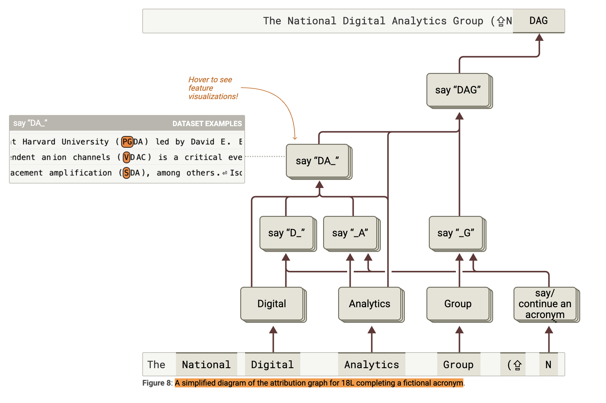

---

marp: true
theme: default
auto-scaling: true
paginate: true
--------------

<style>
.cite {
  position: absolute; /* スライドの特定位置に固定 */
  bottom: 20px;       /* 下から20pxの位置 */
  left: 30px;         /* 左から30pxの位置 */
  font-size: 0.6em;   /* 文字サイズを小さく */
  color: #666;         /* 文字色を少し薄く */
}
table {
  font-size: 1em;
  margin: 20px auto;
}
th, td {
  padding: 15px 30px;
}

section::after {
  content: attr(data-marpit-pagination) ' / ' attr(data-marpit-pagination-total);
  position: absolute;
  bottom: 20px;
  right: 30px;
  font-size: 0.8em;
  color: #666;
}
</style>

<!-- page: title -->

# 説明可能 AI のための対比因子ラベル生成手法
# に関する研究

清野駿（筑波大学大学院 修士 2 年）
機械学習・言語理解（若林）研究室

---

# 目次

<style scoped>
.contents {
  font-size: 1.4em;
  line-height: 1.8;
  margin: 40px 0;
}
</style>

<div class="contents">

1. 背景と目的 (p.3)
2. 手法 (p.9)
3. 実験 (p.13)
4. 結果と考察 (p.20)
5. 結論と今後の研究計画 (p.25)

</div>

---

<!-- page:title -->

# 背景と目的

---

<!--
本研究の背景として、説明可能AIを取り巻く現状について説明します。

現在のAIの社会実装進展によって、「なぜAIがその判断をしたのか？」という疑問が増加しています。
特に医療、法務、教育などの説明責任が求められる分野で、AIの利用が拡大していますが、
AIの判断の理由が説明できないと信用を損なうリスクが伴います。

現在の課題として、多くのAIモデルは判断を出してくれますが、その判断理由は出してくれません。
特にラージランゲージモデル、ChatGPTなどに代表される大規模言語モデルにおいては、
AIの創発的な挙動が人間にとって予測困難なため、各判断が必ずある程度間違っているというリスクが伴ってきます。

AIの判断理由を出す、これまでの取り組みとして、
アテンションマップなどに代表される画像などの判断理由の可視化手法や、
ルール抽出、事後説明型の説明可能AIとして、決定木モデルなどを応用した、
AIの判断理由をニューロン単位で出すなど、様々な取り組みがされています。

しかし、これらの共通の課題として、未知の新しいデータに対して毎回人手で判断理由をラベリングしていく必要があることが挙げられます。

-->

## XAI（説明可能 AI）を取り巻く現状

### 重要性の高まり

- AI の社会実装進展により、**「なぜその判断なのか？」という疑問が増加**
- 医療・法務・教育など、**説明責任**が求められる分野で利用拡大

### 現在の課題

- 多くの AI モデルは「正答を出す」が、**理由は出さない**
- 特に LLM では、**創発的な挙動**が人間にとって予測困難

### これまでの取り組みと限界

- **可視化手法**（Attention Map、SHAP、LIME など）：画像・特徴量に特化
- **ルール抽出・事後説明型 XAI**：決定木や説明生成モデル
- **共通の課題**：未知データに対して**毎回人手でのラベリング**が必要

---

## 人手による解釈のラベリング

<style scoped>
.main-content {
  display: flex;
  flex-direction: row;
  align-items: flex-start;
  gap: 30px;
  margin-top: 20px;
}
.content {
  flex: 1;
}
.image-container {
  flex: 0 0 500px;
  text-align: center;
}
.image-container img {
  max-width: 100%;
  height: auto;
}
</style>

<div class="main-content">

<div class="content">

<!--
この人手による解釈のラベリングという部分について、もう少し深掘りしていきます。

LLMの判断可視化の取り組みとして、右図にAnthropic社が取り組んでいるニューロン発火パターンの可視化について説明させていただきます。

こちらは、まず一番上の文章が「The National Digital Analytics Group (NDAG)」というふうに最終的に出力された文章になりますが、
この「N」大文字の部分までがLLMに対する入力で、後ろの「DAG」大文字3文字がLLMの出力になってきます。

この出力した時の判断理由として、それぞれ「DAGを出しなさい」というニューロンの判断から、
さらに「DA」を出力する、さらに下で「D」を出力する、さらに下でそこから「Digital」というものに着目するというような、
各ニューロンの判断がそれぞれ記載されており、それぞれの単語の先頭大文字を一つずつ取ってきて最終的に「DAG」としました、
という判断過程が可視化されております。

このような説明可能AIを実現するためには、図にも表れていますように、それぞれのニューロンの発火の意味を説明するラベルを付与する必要があります。
例えば、「それぞれの先頭大文字を取ってくる」というニューロンが発火しないと、この判断は成り立たないということが言えると思います。

しかし現状、このニューロンが発火する場合と発火しない場合の集合を見比べて、人手でラベルを付与することでしか、
判断理由を抽出することはできていません。
-->

- LLM の判断可視化の取り組み（右図）
- 説明可能 AI を実現するには、ニューロンの発火の意味を説明するラベルを付与する必要がある

- **現状**：ニューロンが発火する場合と発火しない場合の集合を見比べて**人手でラベルを付与**している
- **課題**：人手でのラベリングには多大なコストと時間がかかる
</div>

<div class="image-container">



ニューロン発火パターンの可視化(anthropic)

</div>

</div>

<div class="cite">
  引用元: <a href="https://transformer-circuits.pub/2025/attribution-graphs/methods.html">https://transformer-circuits.pub/2025/attribution-graphs/methods.html</a>
</div>

---

### 現在の説明手法の課題

- AI 内部の、一つ一つのニューロンの発火する・しないの「意味」を人間が理解できる形で抽出する仕組みが不十分

### 求められる解決策

- ニューロンが発火した場合と、しない場合の入力を比較して、そのニューロンの発火条件を人間が理解できる形で抽出する仕組みが必要

---

<!-- この課題を踏まえて、本研究では対比因子ラベル生成という問題に取り組みます -->

## 対比因子ラベル生成

### 対比因子

「テキスト集合 A に含まれ、テキスト集合 B に含まれない特徴や傾向」

- ニューロンと対比因子の**対応関係**
  テキスト集合 A：ニューロンが発火した場合の入力
  テキスト集合 B：ニューロンが発火しない場合の入力
  対比因子：ニューロンの発火条件

### 本研究における問題設定

**2 つの異なるテキスト集合間に存在する対比因子ラベルを生成する問題**

---

# 本研究の目的

## 2 つの異なるテキスト集合間に存在する対比因子ラベルを生成する手法の、実現可能性を検証すること

- 従来の XAI 分野では人手ラベリングに依存していた「ニューロンの発火条件のラベリング」を、対比因子生成タスクとして定義・検証

---

<!-- page:title -->

# 手法

---

## タスク設定

- **データ集合**：テキストデータセット（例：ゲームレビューデータセット）が与えられる
- **K 個のニューロン**：各ニューロンは、データ集合を以下の 2 つのグループに分割する
  - **グループ A**：ニューロンが発火するデータ
  - **グループ B**：ニューロンが発火しないデータ
- **対比因子ラベル**：ニューロンの発火基準を説明する自然言語テキスト
- K 個のニューロンのうち一部は、対比因子ラベルが既知（訓練データ）

### 目標

- **対比因子ラベルが未知のニューロンに対して、グループ A・B のデータをもとにラベルを生成する**

---

## LLM による対比因子ラベル生成

### 基本アプローチ

1. **入力**：グループ A（発火データ）とグループ B（非発火データ）のテキスト集合
2. **処理**：LLM に**プロンプト**を与え、グループ A に特徴的でグループ B には見られない差異を自然言語で記述させる
3. **出力**：対比因子ラベル（ニューロンの発火条件を説明するテキスト）

### Few-shot 学習の活用

- **0-shot**：例示なしで直接生成
- **1-shot/3-shot**：既知ラベルを例示として与えて生成精度を向上

---

## プロンプト設計と生成処理

```
以下の2つのデータグループを比較して、グループAに特徴的で
グループBには見られない表現パターンや内容の特徴を特定してください。
{examples_section}

【グループA】
{group_a_text}

【グループB】
{group_b_text}

{output_language}で{word_count}程度で、
グループAに特徴的でグループBには見られな主要な違いを簡潔に回答してください。
```

- **Few-shot 例示**：`{examples_section}`で、例題を提示する

  - `【例題】グループ A：〜〜〜　グループ B：〜〜〜　正解：ラベル X`

- `{output_language}`と`{word_count}`で言語・文字数を指定して一貫性を確保

---

<!-- page:title -->

# 実験

---

## 実験の目的

- **目的**：LLM が「対比因子」をどの程度適切に生成できるかを **定量的に評価**
- **データセット**
  - **アスペクト付きレビューデータセット**を使用する
- **実験方法**
  - 特定のアスペクトが**含まれるテキスト群** vs **含まれないテキスト群** を入力として、**前者のテキスト群にのみ含まれるアスペクト**を LLM に説明させる
- **評価方法**
  - LLM の出力テキストと、正解ラベルとの類似度を **BERT/BLEU スコア**で評価

---

## アスペクト付きデータセットを用いた実験設計

- **アスペクト**

  - レビューテキストで言及される**観点・側面**
    `レストランレビューの「food」「service」ゲームレビューの「story」「audio」`

- **実験設計の意図**
  - **アスペクト ＝ ニューロンの発火条件**として設定
  - レビューデータを「アスペクト含有」で 2 分割 → A/B グループ作成
  - A/B グループの差異を LLM に説明させる → 対比因子ラベル生成
  - 正解ラベル（アスペクト名）との類似度で評価

---

## 使用データセット

1. **SemEval レストランレビュー**

   - 例："good food, great price, gread!"
   - 含有アスペクト："food","price", "service"

2. **Steam ゲームレビュー**
   - 例："great sounds and story I have ever played"
   - 含有アスペクト："audio","story"

<div class="cite">
  ※1: Pontiki, M., Galanis, D., Papageorgiou, H., Androutsopoulos, I., Manandhar, S., AL-Smadi, M., ... & Peev, V. (2014). SemEval-2014 Task 4: Aspect Based Sentiment Analysis. In Proceedings of the 8th International Workshop on Semantic Evaluation (SemEval 2014), (pp. 27-35). <a href="https://aclanthology.org/S14-2004/">https://aclanthology.org/S14-2004/</a><br>
  ※2: ilos-vigil. (2024). Steam Review Aspect Dataset. GitHub. <a href="https://github.com/ilos-vigil/steam-review-aspect-dataset">https://github.com/ilos-vigil/steam-review-aspect-dataset</a> Kaggle. <a href="https://www.kaggle.com/datasets/ilosvigil/steam-review-aspect-dataset">https://www.kaggle.com/datasets/ilosvigil/steam-review-aspect-dataset</a> Licensed under CC BY 4.0.
</div>

---

## 変数と固定要素

| 項目           | 設定内容                 |
| -------------- | ------------------------ |
| グループの件数 | 各 300 件（A/B）で固定   |
| Few-shot 設定  | 0-shot / 1-shot / 3-shot |
| 使用 LLM       | GPT-4o-mini（固定）      |
| 評価指標       | BERT / BLEU スコア       |

- Shot 数（例題数）を変えて出力を生成し、**説明精度の傾向を比較・分析**

---

## 評価手法

### 評価の流れ

1. **正解ラベル設定**：A/B グループを「特徴（例：価格）」で分離し、この特徴を正解ラベルとする
2. **ラベル生成**：A/B グループを入力 → LLM 出力（例：「グループ A は価格に言及している」）
3. **類似度評価**：LLM 出力と正解ラベルの類似度を 0~1 のスコアで算出

### 例

- **正解ラベル**：「価格」
- **GPT 出力**：「グループ A は価格に言及」
- **結果**：BERT スコア: 0.76、BLEU スコア: 0.00

---

### 類似度評価手法

- **BERT（Bidirectional Encoder Representations from Transformers ※1）スコア**
  - 意味空間でのベクトル類似（意味レベル）
- **BLEU（Bilingual Evaluation Understudy ※2）スコア**
  - n-gram ベースの表層一致（語彙レベル）

<div class="cite">
  ※1: Devlin, J., Chang, M. W., Lee, K., & Toutanova, K. (2018). BERT: Pre-training of Deep Bidirectional Transformers for Language Understanding. arXiv preprint arXiv:1810.04805. <a href="https://arxiv.org/abs/1810.04805">https://arxiv.org/abs/1810.04805</a><br>
  ※2: Papineni, K., Roukos, S., Ward, T., & Zhu, W. J. (2002). BLEU: a Method for Automatic Evaluation of Machine Translation. In Proceedings of the 40th Annual Meeting of the Association for Computational Linguistics (ACL), (pp. 311-318). <a href="https://aclanthology.org/P02-1040/">https://aclanthology.org/P02-1040/</a>
</div>

---

# 結果と考察

---

### 全体統計

| スコア種類 | 全体平均 | スコア範囲      | SemEval | Steam |
| ---------- | -------- | --------------- | ------- | ----- |
| **BERT**   | 0.5506   | 0.4400 - 0.8240 | 0.718   | 0.672 |
| **BLEU**   | 0.0067   | 0.0000 - 0.0800 | 0.015   | 0.014 |

- **BERT スコア中程度・BLEU スコア極低**：意味レベルでは一致するが語彙レベルでは自由生成傾向
- **文脈理解**：意味的一致は確認できるが表現の多様性が課題

---

## Few-shot 学習による性能向上：1-shot が最も良いスコア

#### 全体的な傾向

| Shot 数 | BERT   | BLEU   | LLM 応答例（レストラン food アスペクト）                  |
| ------- | ------ | ------ | --------------------------------------------------------- |
| 0-shot  | 0.5114 | 0.0000 | "Group A emphasizes staff friendliness and authenticity." |
| 1-shot  | 0.5742 | 0.0100 | "Focus on food quality and dining experience."            |
| 3-shot  | 0.5662 | 0.0100 | "food quality and presentation"                           |

- **LLM の出力傾向**：LLM は「説明的」な表現を好む → 0-shot では説明が曖昧
- **1-shot 効果**：例示 1 つで劇的な性能向上（BERT: 0.51→0.57）
- **出力スタイルの変化**：例示により「正解を一意に特定する」出力スタイルに矯正
  → 例示は LLM にとって出力スタイルの“教師”となる

---

## アスペクトの種類による難易度の傾向

### 全体を通して概念的なデータが判別困難

- 高スコア（gameplay, food, service）
  - 語彙が安定・頻出しやすく、差異が言語的に現れやすい
- 低スコア（recommended, suggestion）
  - 概念的・メタ的であり、テキストから直接抽出が困難

---

## 具体的な補足事例

### アスペクト別平均スコア（高い順）（ゲームレビューデータセット）

| スコア   | gameplay | story | audio | visual | price | technical | suggestion | recom- mended |
| -------- | -------- | ----- | ----- | ------ | ----- | --------- | ---------- | ------------- |
| **BERT** | 0.726    | 0.592 | 0.554 | 0.535  | 0.528 | 0.520     | 0.477      | 0.475         |
| **BLEU** | 0.054    | 0.000 | 0.000 | 0.000  | 0.000 | 0.000     | 0.000      | 0.000         |

- **抽象的なアスペクトは抽出困難**：gameplay/story は抽出しやすく、recommended/suggestion

### レストランレビューデータセット

- アスペクト"**price**"について
  - 具体的なアスペクトだが低スコア（food,service 最低値）
  - 直接的な価格言及ではなく「満足できない」等の間接表現が多い

---

<!-- page:title -->

# 結論と今後の研究計画

---

## 結論

- LLM を活用した対比因子生成は特定の条件下で効果を発揮
- Few-shot プロンプティングにより最大 20% 程度のスコア向上
  - 特に 1-shot 設定での効果が顕著
- 一部アスペクトでは、人間にとっても納得感のある出力
- 一方、抽象性の高いアスペクトにおいて対比因子ラベルの抽出困難

## 本研究の貢献

- LLM を活用した 対比因子生成タスクの枠組みの提案、定量的な評価
- Steam / SemEval という異なるジャンルでの 再現可能な比較実験

---

## 今後の研究計画

- **BERT, BLEU 以外の定量評価**
  - BERT, BLEU スコアでは文脈理解に限界
  - 新たな評価手法（人手、LLM 利用など）を検討
- **レビュー系以外のデータセット検証**
  - 感情分類（例：GoEmotion データセットなど）などの導入検討
- **ベースラインの構築**
  - TF-IDF 等、LLM 以外による対比因子ラベル生成の実装
